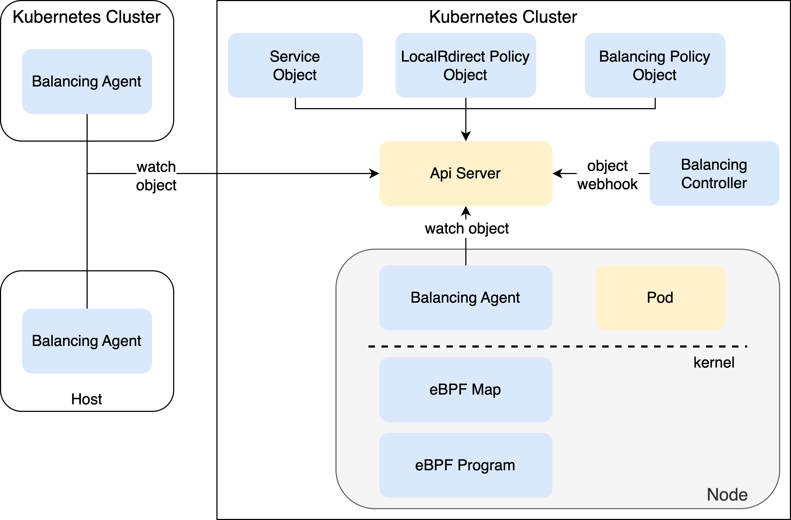
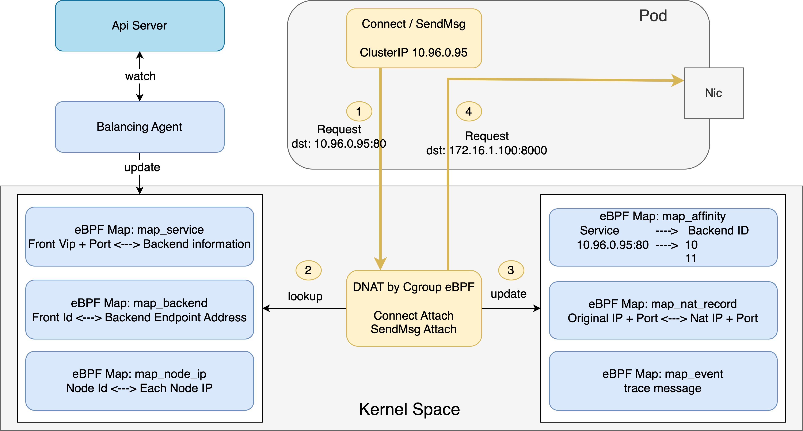

# Balancing

当前，Balancing 处于开发测试阶段，并不合适用于生产部署

## Balancing 简介

Balancing 是一个 kubernetes 平台上基于 eBPF 实施四层负载均衡的组件，它参考了 [cilium](https://github.com/cilium/cilium) 、[calico](https://github.com/projectcalico/calico) 、[KPNG](https://github.com/kubernetes-retired/kpng) 等项目的相关功能实现，实现了 CNI 无关的负载均衡解析扩展能力。

当前，它具备如下功能：

1. 为集群内部 POD 和集群外部的主机应用，实施 service 解析，实现 kube-proxy replacement。

    当前版本的 Balancing ，支持在集群内的节点上基于 cGroup eBPF 来为 Pod 和 Node 发起的 service 解析，支持在集群外部的主
    机上为本地应用提供 cGroup eBPF 解析。

    在后续版本中，Balancing 将实施 node 网卡上基于 TC eBPF 等技术实施南北向的 nodePort 解析。

    更多信息，可参考 [./usages/service.md]

2. 为集群内部 POD 实施 localRedirect policy 四层负载均衡解析。

    在集群内的节点上，基于 cGroup eBPF 来为 Pod 和 Node 发起 service 重定向解析，转发到 client pod 所在节点上的 selected endpoint。

    典型使用的场景，例如，把应用访问 coreDns 的访问重定向解析到本地的 local coreDns 。

    更多信息，可参考 [./usages/localredirect.md]

3. 为集群内部 POD 和集群外部的主机应用实施 balancing policy 四层负载均衡解析（实施中）。

    在集群内的节点和集群外的节点上，基于 cGroup eBPF 来为 Pod 、 Node、application 实施自定义的全局四层负载均衡解析。对于负载均衡前端，可自定义负载均衡的 VIP 和 port，或者指定 kubernetes 中的 service。对于负载均衡的后端，可通过 label selector 来定义后端 endpoint，也可自定义 IP 和 port 地址

    应用使用场景，例如:
    * 在集群外部主机上，通过定义 balancing policy ，实现客户端侧的负载均衡解析，完成对 kubernetes 集群内的服务访问
    * 在 kubernetes 集群内，为 pod 定义集群外部 endpoint 定义负载均衡
    * 实现多集群之间的服务互联

    注意：balancing policy 目前版本只实现了负载均衡解析，还未实现节点间的隧道通信，因此部分场景下不能完成跨节点的数据转发。在下一个版本会完成节点间的隧道互联功能。

4. 事件日志

    对发生的负载均衡解析事件进行记录，并关联相关的容器信息，后续版本会形成指标数据

## 典型使用场景

1. 实施 CNI 无关的 service 解析，完成 kube-proxy replacement

    典型的，为 overlay cni 提供 service 解析，如 [Macvlan](https://github.com/containernetworking/plugins/tree/main/plugins/main/macvlan) 、[SR-IOV CNI](https://github.com/k8snetworkplumbingwg/sriov-cni) 、 [Spiderpool](https://github.com/spidernet-io/spiderpool) ，同时也为 [Antrea](https://github.com/antrea-io/antrea) 、[Kube-ovn](https://github.com/kubeovn/kube-ovn) 、[flannel](https://github.com/flannel-io/flannel) 等 CNI 项目实施 eBPF service 解析。
    尤其在一些公有云的 kubernetes 集群上，为公有云 CNI 实施 eBPF 高效的 service 解析，例如 [amazon-vpc-cni](https://github.com/aws/amazon-vpc-cni-k8s) 、[azure cni](https://github.com/Azure/azure-container-networking) 。

    注：[cilium](https://github.com/cilium/cilium) 、[calico](https://github.com/projectcalico/calico) 自带了 kube-proxy replacement 功能，不需要使用本项目。

2. 为 coreDns 实现重定向解析到 Node-local DNS

    传统方式，修改 pod 的 DNS 配置，指向本地的 Node-local DNS ，因此，在 Node-local DNS 发生故障或者升级时，这并不能为应用完成高可用的服务。而引入第三方组件的解析，能够实现高可用的重定向转发。

3. 集群外部应用通过四层负载均衡地址，访问 kubernetes 集群中的服务

    集群外部主机、kubevirt 虚拟机、kubedge 边缘节点上运行 balancing agent 二进制或者 docker 服务，访问到 kubernetes 集群中的 endpoint。

    传统的 nodePort 或者 Loadbalancer 负载均衡解析，也许会遇到 SNAT 的源端口冲突、长连接超时时间不一致等问题，成为高并发访问的瓶颈。balancing 提供的新方案，能够实现客户端侧的负载均衡解析，减少了转发路径，降低排障难度。

4. 实施多集群之间的四层负载均衡访问

## 架构

Balancing 组件架构如上图所示，由 agent 和 controller 构成：

* controller deployment: 实施各种 CRD 对象的 webhook 校验和修改

* agent daemonset：可运行在集群内，也可部署在主机上，一方面，它向主机内核中加载 eBPF程序，另一方面，它通过监控各种资源对象，向 eBPF map 下发转发规则，从而完成负载均衡解析。

如上图所示，展示了 Balancing agent 实现 eBPF 解析的原理

## Get Started

参考 [安装](./usages/install.md) 快速部署 

参考 [service 解析](./usages/service.md) 进行使用体验

参考 [LocalRedirect Policy](./usages/localredirect.md) 进行使用体验

参考 [Balancing Policy](./usages/balancing.md) 进行使用体验

## Rodmap

* Ip Famliy 和协议
* [x] 支持 TCP 和 UDP
* [x] 支持 IPv4
* [ ] 支持 IPv6

* 可观测性
* [x] 负载均衡解析日志，关联进程所属的 Pod Name 等完整信息
* [ ] 负载均衡解析指标

* service 解析
* [x] 为 POD 和 Node 完成东西向的 service 解析：支持它们主动访问 ClusterIP、NodePort、Loadbalancer、ExternalIp，支持基于 ClientIP 的 sessionAffinity，支持 internalTrafficPolicy 值为 Local
* [ ] 在 node 上完成南北向的 service 解析：支持解析集群外部发送的 service 访问请求，包括 NodePort、Loadbalancer、ExternalIp，支持基于 ClientIP 的 sessionAffinity，支持 externalTrafficPolicy 值为 Local
* [ ] 对于存量的 sessionAffinity=ClientIP 转发记录，应该遵循 backend Pod 的健康状态，当 backend Pod 不可用时，要中断持久化转发

* LocalRedirect Policy
* [x] front 支持指向 service，也支持指向自定义的 VIP 和端口
* [x] backend 支持 pod label selector

* Balancing Policy
* [x] front 支持指向 service，也支持指向自定义的 VIP 和端口
* [x] backend 支持 pod label selector，转发地址支持解析为 endpoint IP、Node HostPort、Node EntryIP
* [x] backend 支持 自定 IP 地址和端口
* [ ] Balancing Agent 支持自动在节点间建立转发隧道，使得在 overlay CNI 场景下实现集群外部的主机应用、多集群之间的通信互联

多集群互联
* [ ] 多集群场景下，多集群的 service 指定能力，以支持跨集群的 service 互联
* [ ] 多集群场景下，多集群的 service 和 Pod 指定能力，以支持跨集群的 balancing policy

其它 
* [x] 支持 amd 架构
* [ ] 支持 arm 架构 (适配工程镜像构建)

## License

Balancing is licensed under the Apache License, Version 2.0. See [LICENSE](./LICENSE) for the full license text.
