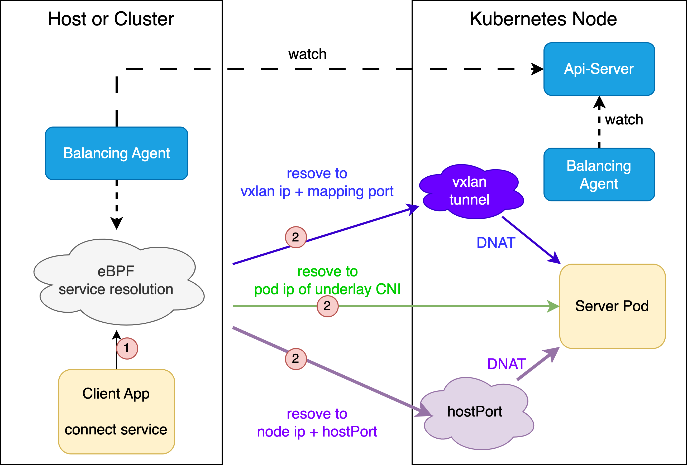

# Balancing Policy

## 简介

Balancing Policy 提供了一种新的负载均衡模式，补充了 Kubernetes 的 service，实现了集群的全局四层负载均衡。

它支持以下对象的请求重定向：
* Pod 中的应用
* 集群节点上的应用
* 集群外部主机上的应用

## 功能



当前功能包括：
* [x] 自定义负载均衡的 front 地址，可以是 Kubernetes 的 service name 或自定义的 VIP 和端口。
* [x] 自定义负载均衡的 backend 地址，通过 pod label selector 指定后端对象，支持以下三种方式：
    * **endpoint IP**：负载均衡地址被 DNAT 解析为 pod IP，适用于所有 POD。
    * **HostPort**：负载均衡地址被 DNAT 解析为 pod 所在的 node IP 和 pod HostPort，适用于定义了 hostPort 的 POD。
    * **nodeProxy**：负载均衡地址被 DNAT 解析为节点的 Proxy IP 和策略中定义的端口，适用于所有 POD。节点的 Proxy IP 定义在 node 对象的 annotation `"balancing.elf.io/nodeProxyIpv4": "192.168.0.10"`，可通过以下方式生成：
        * Balancing agent 自动在节点上建立隧道接口，并更新到 node 的 annotation 中，适用于多集群或集群外部主机应用。
        * 管理员可在 Node 对象上手动设置 annotation `"balancing.elf.io/nodeProxyIpv4"`，例如代理映射 IP 或公网映射 IP。

> 注意：Balancing Policy 和 LocalRedirect Policy 实例之间的 front 不支持绑定相同的 service 或定义相同的虚拟地址，否则会导致解析冲突。

> 如果 Balancing Policy 或 LocalRedirect Policy 的 front 使用了自定义 IP 地址，并与某个 Kubernetes 的 service ClusterIP 冲突，则优先按照 Balancing Policy 或 LocalRedirect Policy 的规则解析。

未来版本将解决以下问题：
* [ ] Balancing Agent 支持自动在节点间建立转发隧道，并更新 IP 地址到 node 的 annotation `"balancing.elf.io/nodeProxyIpv4"`，以实现 overlay CNI 场景下的集群外部主机应用和多集群通信。
* [ ] Balancing Agent 实施对后端自定义的 IP 地址进行健康检查

## 使用场景

1. 在集群外部主机、kubevirt 虚拟机、kubedge 边缘节点上运行 balancing agent 二进制或 docker 服务，访问 Kubernetes 集群中的服务。

   传统的 nodePort 或 Loadbalancer 负载均衡可能会遇到 SNAT 源端口冲突、长连接超时等问题，成为高并发访问的瓶颈。balancing 提供的新方案能够实现客户端侧的负载均衡解析，减少转发路径，降低排障难度。

    > 当前版本中，Balancing 尚未完成节点间的隧道建立和端口分配，因此只能在 underlay CNI 场景下保障集群内外的联通。未来版本中，Balancing 完成隧道建立后，才能保障 overlay CNI 场景下的集群内外连通性。

2. 实现多集群之间的四层负载均衡访问。

   > 当前版本中，Balancing 尚未完成节点间的隧道建立和端口分配，因此只能在 underlay CNI 场景下保障集群内外的联通。未来版本中，Balancing 完成隧道建立后，才能保障 overlay CNI 场景下的集群内外连通性。

3. 集群内定义外部服务的负载均衡地址，提供对集群外部的高可用和负载均衡访问。

4. 自定义 front 负载均衡地址或 backend 转发地址，以支持更灵活的负载均衡需求。

## 策略例子

以下例子中，front 指定了 Kubernetes 中的某个 service，backend 基于 pod 的 label selector 转发到 Pod IP。

```shell
apiVersion: balancing.elf.io/v1beta1
kind: BalancingPolicy
metadata:
  name: test-service-podendpoint
spec:
  frontend:
    serviceMatcher:
      serviceName: http-server-balancing-pod-v4
      namespace: default
      toPorts:
        - port: "8080"
          protocol: TCP
          name: p1
        - port: "80"
          protocol: TCP
          name: p2
  backend:
    serviceEndpoint:
      endpointSelector:
        matchLabels:
          app: http-redirect
      redirectMode: podEndpoint
      toPorts:
        - port: "80"
          protocol: TCP
          name: p1
        - port: "80"
          protocol: TCP
          name: p2
```

以下例子中，front 指定了 Kubernetes 中的某个 service，backend 基于 pod 的 label selector 转发到 Pod 所在节点的 hostPort。

```shell
apiVersion: balancing.elf.io/v1beta1
kind: BalancingPolicy
metadata:
  name: test-service-hostport
spec:
  frontend:
    serviceMatcher:
      serviceName: http-server-balancing-hostport-v4
      namespace: default
      toPorts:
        - port: "80"
          protocol: TCP
          name: p2
  backend:
    serviceEndpoint:
      endpointSelector:
        matchLabels:
          app: http-redirect
      redirectMode: hostPort
      toPorts:
        - port: "20080"
          protocol: TCP
          name: p2
EOF
```

以下例子中，front 指定了 Kubernetes 中的某个 service，backend 基于 pod 的 label selector 转发到 Pod 所在节点的 Proxy IP。

```shell
apiVersion: balancing.elf.io/v1beta1
kind: BalancingPolicy
metadata:
  name: test-service-nodeproxy
spec:
  frontend:
    serviceMatcher:
      serviceName: http-server-balancing-nodeproxy-v4
      namespace: default
      toPorts:
        - port: "80"
          protocol: TCP
          name: p2
  backend:
    serviceEndpoint:
      endpointSelector:
        matchLabels:
          app: http-redirect
      redirectMode: nodeProxy
      toPorts:
        - port: "20080"
          protocol: TCP
          name: p2
EOF
```

以下例子中，front 使用了自定义的虚拟 IP 和端口，backend 使用了自定义的 IP 和端口。

```shell
apiVersion: balancing.elf.io/v1beta1
kind: BalancingPolicy
metadata:
  name: test-addr
spec:
  frontend:
    addressMatcher:
      ip: "169.254.169.254"
      toPorts:
        - port: "8080"
          protocol: TCP
          name: p1
        - port: "80"
          protocol: TCP
          name: p2
  backend:
    addressEndpoint:
      addresses:
        - "1.1.1.1"
        - "1.1.1.2"
      toPorts:
        - port: "80"
          protocol: TCP
          name: p1
        - port: "80"
          protocol: TCP
          name: p2
```
