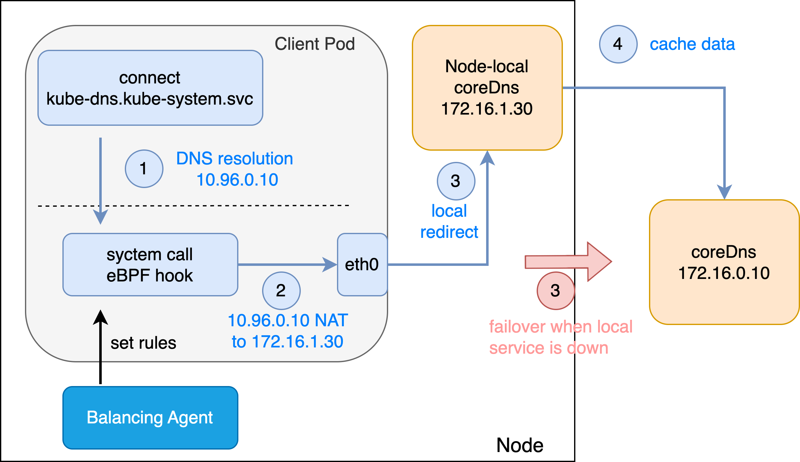

# LocalRedirect 策略

## 介绍

LocalRedirect 策略参考了 [cilium](https://github.com/cilium/cilium) 项目的相关功能，基于 cGroup eBPF 技术，在 Pod 访问指定服务时，将请求重定向到同节点的本地服务。

它支持以下对象的请求重定向：
* Pod 中的应用
* 集群节点上的应用



## 功能

当前版本支持以下功能：

* [x] 前端支持指向服务或自定义的 VIP 和端口
* [x] 后端支持 Pod 标签选择器

> 注意：Balancing Policy 和 LocalRedirect Policy 实例之间，前端不支持绑定相同的服务或定义相同的虚拟地址，否则会导致解析冲突。

> 当 Balancing Policy 或 LocalRedirect Policy 的前端使用自定义 IP 地址时，如果该 IP 地址与某个 Kubernetes 的服务 ClusterIP 冲突，将优先按照策略的转发规则进行解析。

## 使用场景

* 为 Node-local DNS 实施透明重定向
  为了提高 CoreDNS 的服务能力，避免 DNS 雪崩效应，开源社区引入了 Node-local DNS，实现每个节点的 DNS 缓存。

  传统方式中，通过修改 Pod 的 DNS 配置指向本地 Node-local DNS 的虚拟地址，在节点上绑定该虚拟地址。然而，当 Node-local DNS 故障或升级时，这种方式无法为应用提供高可用的 DNS 服务。

  引入 LocalRedirect 策略的重定向能力，无需修改 Pod 的 DNS 配置或引入新的虚拟地址，即可为 Node-local DNS 提供透明、高可用的服务重定向，支持在本地 Node-local DNS 故障或升级期间，将服务访问解析到原本的 CoreDNS 服务。

## 策略示例

以下是一个 YAML 示例，前端指向服务名称：

```yaml
apiVersion: balancing.elf.io/v1beta1
kind: LocalRedirectPolicy
metadata:
  name: test-service
spec:
  enabled: true
  frontend:
    serviceMatcher:
      serviceName: http-server-v4
      namespace: default
      toPorts:
        - port: "8080"
          protocol: TCP
          name: p1
        - port: "80"
          protocol: TCP
          name: p2
  backend:
    endpointSelector:
      matchLabels:
        app: http-redirect
    toPorts:
      - port: "80"
        protocol: TCP
        name: p1
      - port: "80"
        protocol: TCP
        name: p2
```

以下是一个 YAML 示例，前端使用自定义的虚拟 IP 和端口：

```yaml
apiVersion: balancing.elf.io/v1beta1
kind: LocalRedirectPolicy
metadata:
  name: test-addr
  annotations:
     balancing.elf.io/serviceId: "10091"
spec:
  enabled: true
  frontend:
    addressMatcher:
      ip: "169.254.0.90"
      toPorts:
        - port: "8080"
          protocol: TCP
          name: p1
        - port: "80"
          protocol: TCP
          name: p2
  backend:
    endpointSelector:
      matchLabels:
        app: http-redirect
    toPorts:
      - port: "80"
        protocol: TCP
        name: p1
      - port: "80"
        protocol: TCP
        name: p2
```
